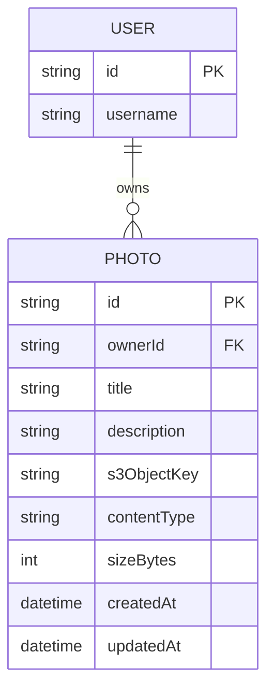

# Domain Model

A single entity captures the whole product: a photo owned by one signed-in user, whose image bytes live in S3 while its metadata lives in `photo-api`'s database.

`USER` is the signed-in identity from Thunder — `photo-api` never stores credentials, only the owner id (`sub`) on each `PHOTO` row. `s3ObjectKey` is the object's key in the S3 bucket; the image bytes themselves never pass through `photo-api`.