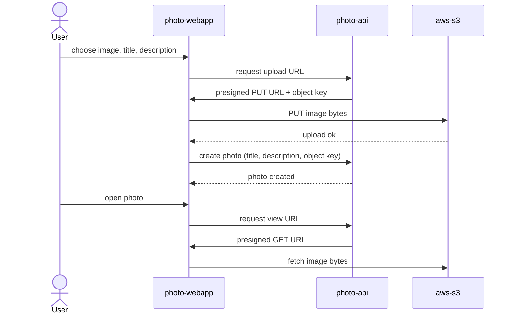

# Upload a Photo

A signed-in User uploads a photo: the browser gets a presigned URL from `photo-api`, uploads the image bytes straight to S3, then confirms the upload so `photo-api` records the photo's metadata.

